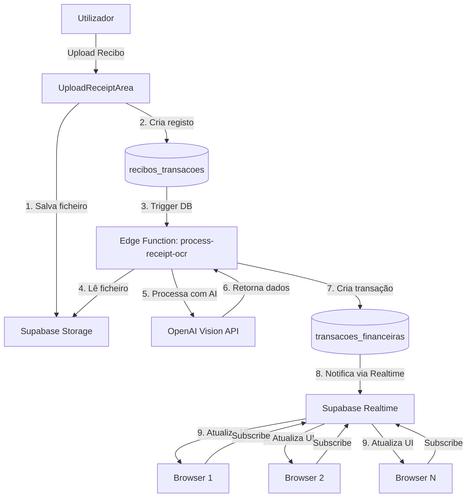

# Sistema de Finanças com Realtime e Processamento Automático de Recibos

## Contexto Atual

O sistema de finanças já possui:

- Tabela `transacoes_financeiras` com campo `estado` (pendente/verificado/rejeitado)
- Hook `useTransactions` que busca transações do banco
- Componente `TransactionsHistory` que mostra badge de status
- Upload de recibos via `useReceiptUpload` para bucket `faturas-recibos`
- Processamento manual de imagens via OpenAI Vision no `useFinanceAgent`

## Problemas Identificados

1. **Sem Realtime**: Transações não atualizam automaticamente entre browsers
2. **Processamento Manual**: Upload de recibo requer ação manual do utilizador para processar
3. **Badge não funcional**: O badge "Pendente de Revisão" não reflete mudanças em tempo real
4. **Sem auto-processamento**: Recibos não são automaticamente analisados pela AI após upload

## Arquitetura da Solução




## Implementação

### 0. Redesenhar Interface do Chat (Pré-requisito UI)

Modificar `[src/dashboard/pages/Finance/components/FinanceChat.tsx](src/dashboard/pages/Finance/components/FinanceChat.tsx)`:

**Mudanças no título:**

- Alterar "🤖 Assistente de Entrada AI" para "Carla, Assistente Financeira"
- Remover emoji do título

**Mudanças nas mensagens do assistente:**

- Remover o avatar circular com emoji 🤖
- Remover background colorido (#F5F5DC)
- Mensagens da Carla: texto simples alinhado à esquerda, sem background

**Mudanças nas mensagens do utilizador:**

- Estilo SMS: alinhadas à direita
- Sem background (ou background muito subtil)
- Aparência minimalista como ChatGPT

**Atualizar textos em `[src/dashboard/pages/Finance/i18n.ts](src/dashboard/pages/Finance/i18n.ts)`:**

- `assistantTitle`: "Carla, Assistente Financeira"
- `agentWelcome`: Mensagem de boas-vindas da Carla

### 1. Habilitar Realtime na Tabela

Adicionar a tabela `transacoes_financeiras` à publicação do Realtime via migração SQL:

```sql
ALTER PUBLICATION supabase_realtime ADD TABLE transacoes_financeiras;
```

### 2. Criar Hook de Realtime

Criar `[src/dashboard/hooks/useTransactionsRealtime.ts](src/dashboard/hooks/useTransactionsRealtime.ts)`:

- Subscribe a mudanças INSERT/UPDATE/DELETE na tabela `transacoes_financeiras`
- Invalidar queries do React Query quando houver mudanças
- Filtrar por `user_id` para receber apenas transações do utilizador atual

Exemplo de código:

```typescript
const channel = supabase
  .channel('transacoes-changes')
  .on(
    'postgres_changes',
    {
      event: '*',
      schema: 'public',
      table: 'transacoes_financeiras',
      filter: `user_id=eq.${user.id}`,
    },
    (payload) => {
      queryClient.invalidateQueries({ queryKey: ['transacoes_financeiras'] });
    }
  )
  .subscribe();
```

### 3. Integrar Realtime no useTransactions

Modificar `[src/dashboard/hooks/useTransactions.ts](src/dashboard/hooks/useTransactions.ts)`:

- Importar e usar o hook `useTransactionsRealtime`
- Garantir que a subscription é limpa no cleanup

### 4. Criar Edge Function para Processamento Automático

Criar/modificar `[supabase/functions/process-receipt-ocr/index.ts](supabase/functions/process-receipt-ocr/index.ts)`:

- Trigger automático quando um recibo é inserido em `recibos_transacoes`
- Ler ficheiro do Storage usando o `file_path`
- Converter para base64
- Chamar OpenAI Vision API para extrair dados
- Criar transação automaticamente em `transacoes_financeiras` com `estado: 'pendente'`
- Atualizar `recibos_transacoes` com `ocr_processed: true` e `ocr_text`

### 5. Criar Database Trigger

Adicionar trigger via migração SQL que chama a Edge Function quando um recibo é inserido:

```sql
CREATE OR REPLACE FUNCTION trigger_process_receipt()
RETURNS TRIGGER AS $$
BEGIN
  PERFORM net.http_post(
    url := 'https://[PROJECT_REF].supabase.co/functions/v1/process-receipt-ocr',
    headers := jsonb_build_object(
      'Content-Type', 'application/json',
      'Authorization', 'Bearer ' || current_setting('request.jwt.claims', true)::json->>'token'
    ),
    body := jsonb_build_object(
      'recibo_id', NEW.id,
      'file_path', NEW.file_path,
      'user_id', NEW.user_id
    )
  );
  RETURN NEW;
END;
$$ LANGUAGE plpgsql SECURITY DEFINER;

CREATE TRIGGER on_recibo_inserted
  AFTER INSERT ON recibos_transacoes
  FOR EACH ROW
  EXECUTE FUNCTION trigger_process_receipt();
```

### 6. Modificar Fluxo de Upload

Atualizar `[src/dashboard/pages/Finance/index.tsx](src/dashboard/pages/Finance/index.tsx)`:

- Após upload bem-sucedido, criar registo em `recibos_transacoes`
- Remover chamada manual a `processImage`
- Mostrar loading state enquanto AI processa
- Aguardar que transação apareça via Realtime

### 7. Adicionar Loading State

Criar componente de feedback visual:

- Mostrar "A processar recibo..." após upload
- Usar Realtime para detectar quando transação é criada
- Automaticamente popular o preview quando dados chegarem

### 8. Badge de Status em Tempo Real

O badge já existe em `[TransactionsHistory.tsx](src/dashboard/pages/Finance/components/TransactionsHistory.tsx)`:

- Com Realtime ativo, o badge atualiza automaticamente
- Quando `estado` muda de 'pendente' para 'verificado', todos os browsers veem a mudança
- Sem necessidade de refresh manual

## Fluxo Completo do Utilizador

1. Utilizador faz upload de recibo
2. Ficheiro é salvo no Storage
3. Registo criado em `recibos_transacoes`
4. Trigger DB chama Edge Function automaticamente
5. Edge Function processa recibo com OpenAI Vision
6. Transação criada automaticamente com `estado: 'pendente'`
7. Realtime notifica todos os browsers conectados
8. UI atualiza automaticamente com nova transação
9. Badge "Pendente de Revisão" aparece
10. Utilizador pode revisar e confirmar/editar no preview
11. Ao confirmar, `estado` muda para 'verificado'
12. Badge atualiza em tempo real em todos os browsers

## Benefícios

- Sincronização automática entre múltiplos browsers
- Processamento automático de recibos sem intervenção manual
- Feedback visual em tempo real do estado das transações
- Redução de cliques e ações manuais
- Experiência mais fluida e moderna

